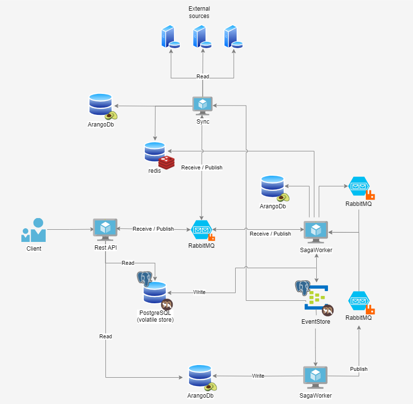

This README is just a fast quick-start document. 

# UserProfileService

Developed by the people of [A/V Software Solutions 360°](https://av360.io/) for all human beings of the world.

## What is the UserProfileService (or UPS)

_Short answer:_ A service used to manage user data

It has been developed as an internal data storage to manage all kind of personal data and the container items that hold it.
It is part of the Maverick stack of [A/V Software Solutions 360°](https://av360.io/), a department of [Bechtle AG & Co KG in Bonn](https://www.bechtle.com/ueber-bechtle/unternehmen/standorte/bechtle-it-systemhaus-bonn-koeln-hauptsitz-bonn).

We decided to push most of the code to Github to let others see what we are doing.  
Most of it means, that there are still parts that are closed-source due to customers concerns.

## Features

* Manages user data including their relations
* Used entities are hierarchical structured and therefore are stored in a graph.  
  like:
  - _Users_ are stored in groups
  - _Organizations_ can contain other _organizations_
  - _Users_ or _groups_ can be assigned to _Functions_ or _Roles_
  - _Functions_ limit access of their containing _role_ by an additional _organization_
  - and many more ...
* Uses state-of-the art design patterns to enable best performance in a cloud system without loosing data consistency.
  - Event Sourcing ([more info](https://learn.microsoft.com/en-us/azure/architecture/patterns/event-sourcing))
  - Event Driven Design (EDD) ([more info](https://levelup.gitconnected.com/understanding-event-driven-design-patterns-for-microservices-659b3c9fb51f))
  - Command-Query-Responsibility-Segregation (CQRS)-Pattern ([more info](https://learn.microsoft.com/en-us/azure/architecture/patterns/cqrs))
  - Asynchronous Request-Reply pattern ([more info](https://learn.microsoft.com/en-us/azure/architecture/patterns/async-request-reply))
  - Saga pattern ([more info](https://microservices.io/patterns/data/saga.html))
  - decoupled dependencies
* Can store the incoming requests in various ways due to its "data projections"
* Contains entity models for roles and functions that can be used as source of a RBAC system or [OPA](https://www.openpolicyagent.org/)

## Architecture

The UserProfileService consists of three main components:

 - **UserProfileService.API** - It represents the interface that can be accessed by public networks. It is a RestAPI and holds many endpoints to manage profile entities.
 - **UserProfileService.SagaWorker** - It works in the background and executes commands that are triggered from the _API_ or _Sync_. It validates and changes data. It listens to queues and therefore is not intended to be public. For security reasons its endpoints should be kept behind a firewall / inside an internal network only.
 - **UserProfileService.Sync** - It enables the synchronization of data from external sources with the existing stored data. At the moment we implemented a LDAP connector as external source.



## Building UserProfileService

- [Install](https://dotnet.microsoft.com/en-us/download/dotnet/6.0) the latest .NET 6.0 SDK
- [Install](https://git-scm.com/downloads) Git
- Clone this repo
- Run `dotnet restore` and `dotnet build` in solution folder

## Bug reports and feature requests

Please use the [issue tracker](https://github.com/EmmanuelAv360/UserProfileService/issues) for that.

## Running UserProfileService

Before running the UserProfileService you should install the third-party components.  

This should be done by the approppriate documentation that can be found online.

**Be aware:** Both workers (_SagaWorker_ and _Sync_) should be deployed as single instances. Scalability is not supported at the moment.

### Used third-party dependencies

Following third-party systems are required:

* [ArangoDb](https://www.arangodb.com/) - open-source graph- and document database where user data will be stored
* [RabbitMq](https://www.rabbitmq.com/) - multi-protocol messaging and streaming broker - used to send messages between applications
* [PostgreSQL](https://www.postgresql.org/) - fast relational database used as volatile store and eventStore
* [redis](https://redis.com/) - open source, in-memory data structure store, used as a database, cache, and message broker. 

### Configuration

#### Database connections

##### ArangoDb

The UserProfileService uses a graph database called [ArangoDb](https://www.arangodb.com/).

Example configuration section (as pasrt of the complete appsettings file):

```json
{
  "ProfileStorage": {
    "ClusterConfiguration": {
      "DocumentCollections": {
        "*": {
          "NumberOfShards": 3,
          "ReplicationFactor": 2,
          "WriteConcern": 1
        }
      },
      "EdgeCollections": {
        "*": {
          "NumberOfShards": 3,
          "ReplicationFactor": 2,
          "WriteConcern": 1
        }
      }
    },
    "ConnectionString": "Endpoints=http://localhost:8529;UserName=myUser;Password=myPassword;database=UserProfileService",
    "MinutesBetweenChecks": 60
  }
}
```

The `connection string` contains the endpoint of the ArangoDb graph databse, the credentials and the database to use.

_Side note:_ The specified user must have manage permissions for this database. The service will create collections and therefore needs additional rights.

The `cluster configuration` contains information about sharding in a cluster environment when collections are created. It will be ignored on _single-node_ installations.

`MinutesBetweenChecks` defines the timespan the database initializer unit will wait until it will ensure all collections has been created. It will do this at the starting of the service as well.  
This shall minimize the requests sending to ArangoDb during execution of the application.

##### PostgreSQL

The UserProfileService uses [PostgreSQL](https://www.postgresql.org/) as a relational database. It can be configured as follows:
 
The `Connection string` defines all parameters to establish a database connection (see [NpgSql docs - connection string parameters](https://www.npgsql.org/doc/connection-string-parameters.html]))

`DatabaseSchema` defines the name of the schema to be used.

Example:

```json
{
  "Marten": {
    "ConnectionString": "Host=localhost;Port=5432;Username=myUser;Password=myPassword;Database=UserProfileService",
    "DatabaseSchema": "UserProfile"
  }
}
```

#### Message broker connection

The UserProfileService uses [RabbitMq](https://www.rabbitmq.com/) to send its internal messages.

An example configuration section could look like this:

```json
{
  "Messaging": {
    "RabbitMQ": {
      "Host": "localhost",
      "Password": "myPassword",
      "Port": 5672,
      "User": "myUser",
      "VirtualHost": "/"
    }
  }
}
```

`Host`, `Port` and `VirtualHost` define the endpoint of rabbitMQ.

`User` and `Password` are credential information to connect to RabbitMQ.

#### Redis
The UserProfileService-Sync uses Redis as a temporary storage for the synchronized data.

An example configuration section could look like this:

```json
  "Redis": {
    "ServiceName": "redis",
    "AbortOnConnectFail": "False",
    "AllowAdmin": "True",
    "ConnectRetry": 5,
    "ConnectTimeout": 5000,
    "EndpointUrls": [
      "localhost:6379"
    ],
    "ExpirationTime": 7200,
    "Password": "",
    "User": ""
  }
```

The `EndpointUrls` define the endpoints for Redis. Please note that `EndpointUrls` is an array where you can store more than one Redis endpoint. In this section, Redis is only bound to localhost. The port **6379** is the standard port for Redis.

The `User` and `Password` are used for authentication to the Redis system.

The other configuration options for redis:

`ServiceName` -  The service name used to resolve a service via the [Sentinel](https://redis.io/docs/management/sentinel/).

`AbortOnConnectFail` - The connect will not create a connection while no servers are available.

`AllowAdmin` - Enables a range of commands that are considered risky.

`ConnectRetry` - The number of times to repeat connect attempts during initial Connect.
 
`ConnectTimeout` - Timeout (ms) for connect operations.

`ExpirationTime` - Expiration time after the stored values in redis expires and are deleted (in seconds).


#### Logging

The configuration uses the default .NET Core "Logging" configuration of the MEL stack and extends it in an easy way.  
We are using `NLog` internally to write logs.

##### Configuration LogLevel

> **Note:** If no configuration is provided the logframework will only log `Information` or higher (higher meaning greater loglevel value)

| LogLevel    | Value | Method         | Description                                                                                                                                                        |
|-------------|-------|----------------|--------------------------------------------------------------------------------------------------------------------------------------------------------------------|
| Trace       | 0     | LogTrace       | Contain the most detailed messages. These messages may contain sensitive app data. These messages are disabled by default and should not be enabled in production. |
| Debug       | 1     | LogDebug       | For debugging and development. Use with caution in production due to the high volume.                                                                              |
| Information | 2     | LogInformation | Tracks the general flow of the app. May have long-term value.                                                                                                      |
| Warning     | 3     | LogWarning     | For abnormal or unexpected events. Typically includes errors or conditions that don't cause the app to fail.                                                       |
| Error       | 4     | LogError       | For errors and exceptions that cannot be handled. These messages indicate a failure in the current operation or request, not an app-wide failure.                  |
| Critical    | 5     | LogCritical    | For failures that require immediate attention. Examples: data loss scenarios, out of disk space.                                                                   |
| None        | 6     |                | Specifies that a logging category should not write any messages.                                                                                                   |

> **Note:** In the `LogLevel` sub-section you can configure the category specific log level and the global log level.
> The most specific category configuration is used meaning if `SomeCategory` is set to Error but `SomeCategory.SubSomeCategory`
> is set to trace, than everything in `SomeCategory` only logs error or higher, but everything staring from `SomeCategory.SubSomeCategory` will log trace or higher

To specify the global loglevel use the `Default` category name

``` json
{
  "Logging": {
    "LogLevel": {
      "Default": "Trace",
      "<CategoryName>": "<LogLevel as string>"
    }
  }
}
```

##### Configuration reload

The log levels can be change at runtime and apply almost immediately.
The application does not need to take any action to enable this other than calling
`loggingBuilder.UseMaverickLogging(config)` and providing a `IConfiguration` instance.

##### Default configuration (console only)
``` json
{
  "Logging": {
    "LogLevel": {
      "Default": "Information"
    }
  }
}
```

##### File Logging

To include file logging you need to add the following config-keys inside the "Logging" section

``` json
{
  "Logging": {
    "EnableLogFile": true, // (Optional) default: false
    "LogFilePath": "logs" // (Optional) default: "logs"
    "LogFileMaxHistory": 3 // (Optional) default: 3
  }
}
```

##### Log format (Text or JSON)

To change the log format from JSON (default) to Plaintext change the `LogFormat` key to the value of `text` or `json`

``` json
{
  "Logging": {
    "LogFormat": "text"
  }
}
```

#### Tracing

Basic configuration requires you to set at least a service name. The service name will be displayed in the trace graph and used to correlate the logs
If you also provide an OtlpEndpoint URI the OtlpExporter will be setup to send traces via GRPC in the OTLP format to the provided endpoint

#### Base-Path handling

Additionally, you can opt-in to automatically handle routing base-paths.  
This is useful to make your service available behind a reverse-proxy or similar setup.
To do this, you need to use this method: 
- Full Path: `Maverick.Extensions.Hosting.ApplicationBuilderExtensions.UseMaverickProxyPaths`
- As extension: `appBuilder.UseMaverickProxyPaths(Configuration)`

This extension will look for these settings, and configure your application accordingly:
```json
{
    "Routing": {
        "PathBase": "",
        "DiscardResponsePathBase": ""
    }
}
```

When setting `Routing:PathBase`, your application will accept requests to all of your usual endpoints (`/api/foo`), but also those that have the configured Prefix (`/service/api/foo`).  
This ensures compatibility with or without reverse-proxy, and pushes consumers of your API to use endpoints with their respective `PathBase`.  
You can check `HttpContext.Request.PathBase` to see if the current request was handled with or without base-path.  
If `Routing:PathBase` is set, all redirects will be relative to the configured `PathBase`, even for those that were handled without it.

- `/api/foo` redirecting to the `api/bar`-Endpoint will instead be redirected to `/service/api/bar`
- `/service/api/foo` redirecting to the `api/bar`-Endpoint will also redirect to `/service/api/bar`

When setting `Routing:DiscardResponsePathBase` your application will behave as if `Routing:PathBase` was set, but instead of changing all redirects to use the configured prefix, it will be removed from all redirects.

- `/api/foo` redirecting to the `api/bar`-Endpoint will still be redirected to `/api/bar`
- `/service/api/foo` redirecting to the `api/bar`-Endpoint will instead redirect to `/api/bar`

##### Technical notes to Base-Path handling

There are three components to the Base-Path handling, one of which is hidden.
- `PathBase`
  - Endpoints will also be bound with this as prefix
- `ResponsePrefix`
  - Ensures outgoing responses use this prefix in their path
- `DiscardResponsePathBase`
  - Removes this path from the start of all outgoing responses

For simplicity's sake we chose to omit `RequestPrefix` and always use it together with `PathBase`, which leaves only Options 0 (no settings), 2 (`PathBase`), and 4 (`DiscardResponsePathBase`).

Using these three settings in different configurations results in these Use-Cases:

###### Option 0 - Fallback
- No option used
- Endpoints bound using `Base=/`
- Redirects always use `PathBase=/`

Without any configuration services will use **Option-0**, they will only be bound and respond to the endpoints defined in the code.  
To use this configuration each service needs its own hostname or ip to respond to.

###### Option 1 - Not Supported
- `PathBase=/service`
- Endpoints bound using `Base=/` and `Base=/service`
- Redirects keep the Base they originally arrived with

Basically the same as **Option-2**, but doesn't show or encourage use of endpoints with a defined Base.

###### Option 2 - Target-Default
- `PathBase=/service` + `RequestPrefix=/service`
- Endpoints bound using `Base=/` and `Base=/service`
- Redirects will always use `Base=/service`

Basically the same as **Options-1**, but pushes consumers to use endpoints with a defined Base.  
We chose to implicitly use **Option-2** and hide **Option-1**, to hopefully reduce bugs related to path-mapped services.

###### Option 3 - Not Supported
- `RequestPrefix=/service`
- Endpoints bound using `Base=/`
- Redirects will always use `Base=/service`

While writing this extension we could find no real use-case for **Option-3**.

###### Option 4 - Supported just in case
- `DiscardResponsePathBase=/service` + (`RequestPrefix=""` & `PathBase=""`)
  - Using `DiscardResponsePathBase` with any other option did not lead to usable results
- Endpoints bound using `Base=/` and `Base=/service`
- Redirects will always use `Base=/`

While we don't expect usage of **Option-4**, we can see scenarios where this configuration makes sense, so we added it to this extension.  
Using `DiscardResponsePathBase` with any other setting did not produce usable results, so we chose to treat its use with other settings as an error.

## Docker Deployment

 We have prepared a set of docker
 comose files, allowing you to effortlessly set up and explore UserProfileService in isolated containers.The files include all third-party dependencies and are pre-configured to run seamlessly within the container environment.

 The examples can be found [here](https://github.com/bechtleav360/Maverick.UserProfileService/tree/main/examples).


## Licensing

### Used packages

We are using following great third-party-libraries:

* Automapper
* MassTransit
* Marten
* JsonSubtypes
* Newtonsoft.Json
* Swashbuckle
* Hellang ProblemDetails
* prometheus-net
* StackExchange.Redis
* NLog
* FluentValidations

And for testing:

* XUnit
* FluentAssertions
* AutoFixture
* Bogus
* Moq