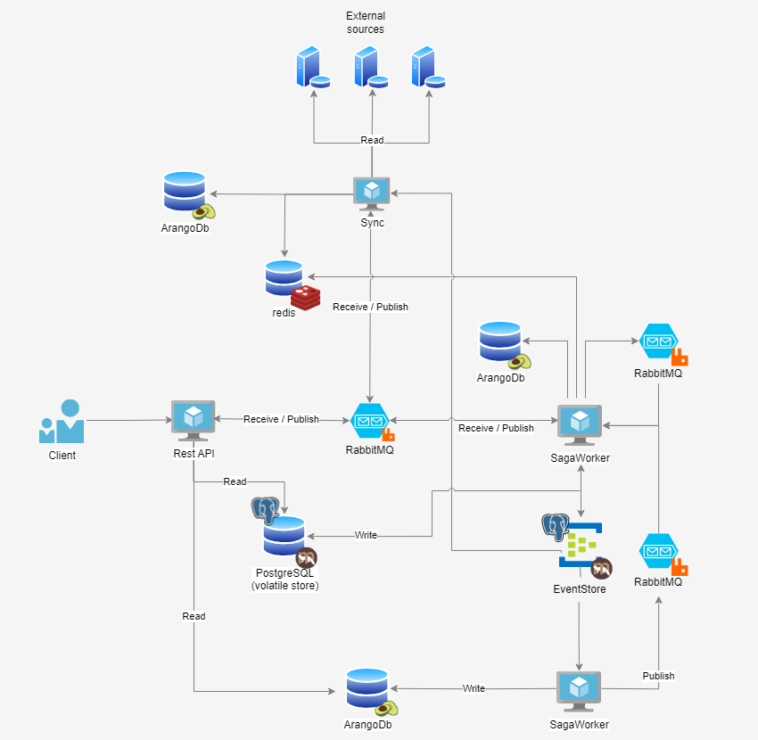

# Main Architecture

The UserProfileService consists of three main components:

### UserProfileService.API 
This is an interface accessible through public networks, specifically a RestAPI with numerous endpoints designed for managing profile entities.

### UserProfileService.SagaWorker
This system operates behind the scenes, carrying out commands triggered by the API or Sync processes. It validates and modifies data, and also monitors queues. Due to its nature, it is not meant to be publicly accessible. For security purposes, its endpoints should be restricted behind a firewall or within an internal network.

### UserProfileService.Sync 
It facilitates the synchronization of data from external sources with the data currently stored. Currently, we have implemented an LDAP connector as one of these external sources.

### The Architecture

The picture illustrates the comprehensive architecture of the UPS system. Clients can request entities stored in the database. The UPS API then retrieves these entities directly from ArangoDB. The models are stored in the database in the format required by the program, minimizing the need for significant transformations when they are returned.

The Client also has the capability to create an entity, such as a group. When a request is made, the API processes the request and returns a ticket as described below. The API then places a command into a queue that is connected to the SagaWorker. The SagaWorker receives the command and performs the following steps:

1. Receives the GroupCreate message.

1. Validates the group.

1. Stores the group in the EventStore, a centralized database for storing events. We utilize the PostgreSQL database along with Marten for this purpose.

1. Projects the group into the Arango database.

If the validation of the group or the storing in the EventStore fails, the entire process will be aborted and reversed.

It is also noted that UPS-Sync can synchronize entities from an external source, currently limited to LDAP systems. UPS-Sync uses Redis to temporarily store entities that need synchronization. The Sync module then sends messages to the queue, where the SagaWorker listens and creates the necessary entities in the database. Once an entity is created, the Sync module receives a confirmation message.UPS-Sync can thus keep track of the synchronized entities.